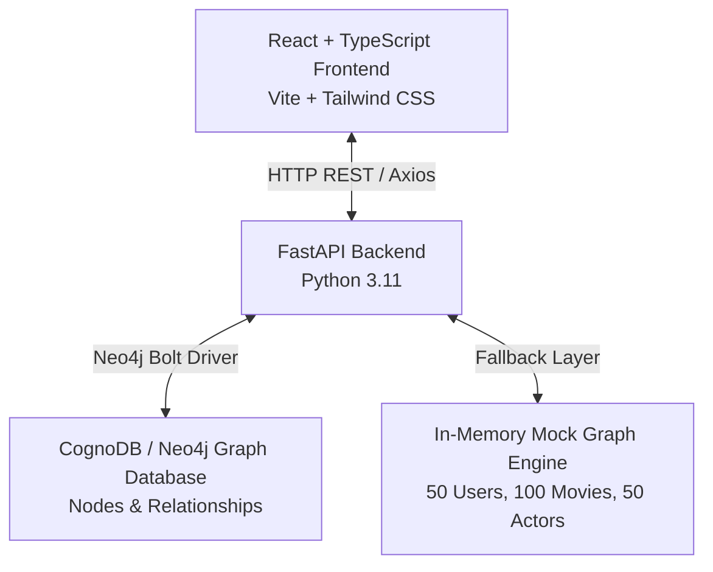
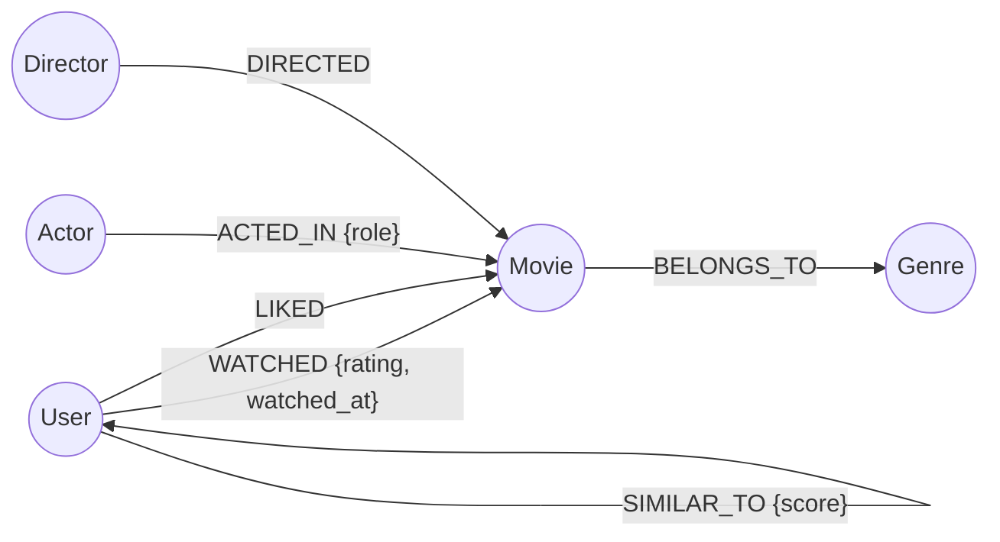

# 🎬 CognoDB Movie Recommendation Graph Platform

> **WEXA AI CognoDB Graph Database Assignment** — A complete production-ready full-stack application built with **CognoDB / Neo4j Graph Database**, **Python FastAPI**, **React (TypeScript + Vite + Tailwind CSS)**, and an **Interactive Canvas Graph Visualizer**.

---

## 📌 Project Overview

The **Movie Recommendation Graph Platform** models film industry entities as interconnected graph nodes (`User`, `Movie`, `Actor`, `Director`, `Genre`) and leverages multi-hop Cypher traversals to deliver real-time personalized recommendations, similarity matching, and network topology visualization.

### Key Features
1. **Interactive Dashboard**: Real-time graph metrics, top-rated movies, and quick recommendations.
2. **Browse Movies**: Catalog filtering by genres, search, and sorting.
3. **Movie & Entity Details**: Deep dive into movies, cast filmography, directors, and graph engagement stats.
4. **Interactive Canvas Graph Explorer**: HTML5 Canvas visualization of nodes and edges with filter controls, node inspection overlays, and drag physics.
5. **Genre Explorer**: Visual genre node distribution and movie filtering.
6. **Multi-Hop Genre Recommendations (Query 4)**: `User → Liked Movie → Genre → Movie` (2+ hops).
7. **Collaborative Traversal Recommendations (Query 6)**: `User → Similar User → Liked Movie` (2+ hops).
8. **Similar Users Graph (Query 3)**: User similarity matching via Jaccard/Cosines on shared liked movies.
9. **Actor Co-Star Connections (Query 5)**: Graph paths between actors who shared screen time.
10. **Graceful Database Handling**: Built-in mock dataset fallback mechanism so the entire full-stack app works smoothly whether or not a live CognoDB cloud instance is connected.

---

## ⚡ Why a Graph Database vs Relational Database (SQL)?

| Dimension | Relational DB (RDBMS / SQL) | Graph DB (CognoDB / Cypher) |
|---|---|---|
| **Multi-Hop Traversal** | Requires multiple expensive `JOIN` statements across tables. | Index-free adjacency: direct memory pointer traversals in **O(1)** constant time. |
| **Query Complexity** | Highly verbose SQL queries with nested subqueries. | Expressive, intuitive Cypher pattern matching: `(u:User)-[:LIKED]->(:Movie)`. |
| **Performance Scaling** | Query latency grows exponentially **O(N<sup>k</sup>)** with hop depth. | Traversal time depends only on subgraph size visited, not total database size. |
| **Schema Evolution** | Schema alterations require migrations and table locks. | Schema-free or flexible: seamlessly add new node labels and edge types. |

---

## 🏗️ System Architecture



---

## 📊 Data Model Diagram



### Graph Entities
- **Nodes**:
  - `User`: `id`, `name`, `email`, `avatar_url`, `joined_date`
  - `Movie`: `id`, `title`, `release_year`, `rating`, `duration_mins`, `poster_url`, `plot`
  - `Actor`: `id`, `name`, `birth_year`, `photo_url`, `bio`
  - `Director`: `id`, `name`, `photo_url`, `bio`
  - `Genre`: `id`, `name`
- **Relationships**:
  - `(:User)-[:WATCHED {rating, watched_at}]->(:Movie)`
  - `(:User)-[:LIKED]->(:Movie)`
  - `(:Movie)-[:BELONGS_TO]->(:Genre)`
  - `(:Actor)-[:ACTED_IN {character_name}]->(:Movie)`
  - `(:Director)-[:DIRECTED]->(:Movie)`
  - `(:User)-[:SIMILAR_TO {score}]->(:User)`

---

## 🔍 Required Cypher Queries Catalog

### Query 1: Get all movies liked by a user
```cypher
MATCH (u:User {id: $user_id})-[:LIKED]->(m:Movie)
OPTIONAL MATCH (m)-[:BELONGS_TO]->(g:Genre)
OPTIONAL MATCH (d:Director)-[:DIRECTED]->(m)
RETURN m.id AS id, m.title AS title, m.release_year AS release_year, m.rating AS rating,
       m.duration_mins AS duration_mins, m.poster_url AS poster_url,
       collect(DISTINCT g.name) AS genres, d.name AS director
ORDER BY m.rating DESC;
```

### Query 2: Get top-rated movies
```cypher
MATCH (m:Movie)
OPTIONAL MATCH (m)-[:BELONGS_TO]->(g:Genre)
OPTIONAL MATCH (d:Director)-[:DIRECTED]->(m)
RETURN m.id AS id, m.title AS title, m.release_year AS release_year, m.rating AS rating,
       m.poster_url AS poster_url, collect(DISTINCT g.name) AS genres, d.name AS director
ORDER BY m.rating DESC
LIMIT $limit;
```

### Query 3: Find users with similar interests
```cypher
MATCH (u1:User {id: $user_id})-[s:SIMILAR_TO]-(u2:User)
OPTIONAL MATCH (u2)-[:LIKED]->(m:Movie)
RETURN u2.id AS id, u2.name AS name, u2.email AS email, u2.avatar_url AS avatar_url,
       s.score AS similarity_score, collect(DISTINCT m.title)[..3] AS common_liked_movies
ORDER BY s.score DESC;
```

### Query 4 (Multi-hop Traversal: 2+ Hops): User → Movie → Genre → Movie
```cypher
MATCH (u:User {id: $user_id})-[:LIKED]->(m1:Movie)-[:BELONGS_TO]->(g:Genre)<-[:BELONGS_TO]-(rec:Movie)
WHERE NOT (u)-[:WATCHED]->(rec) AND rec <> m1
WITH rec, collect(DISTINCT g.name) AS matching_genres, count(DISTINCT g) AS common_genres_count
RETURN rec.id AS id, rec.title AS title, rec.release_year AS release_year, rec.rating AS rating,
       rec.poster_url AS poster_url, matching_genres, common_genres_count
ORDER BY common_genres_count DESC, rec.rating DESC
LIMIT $limit;
```

### Query 5: Find connections between actors through movies
```cypher
MATCH (a1:Actor {id: $actor_id})-[:ACTED_IN]->(m:Movie)<-[:ACTED_IN]-(a2:Actor)
RETURN a2.id AS co_actor_id, a2.name AS co_actor_name, a2.photo_url AS photo_url,
       collect(DISTINCT m.title) AS shared_movies, count(DISTINCT m) AS movie_count
ORDER BY movie_count DESC;
```

### Query 6 (Multi-hop Collaborative Traversal: 2+ Hops): User → Similar User → Liked Movie
```cypher
MATCH (u:User {id: $user_id})-[s:SIMILAR_TO]-(sim:User)-[:LIKED]->(m:Movie)
WHERE NOT (u)-[:WATCHED]->(m)
WITH m, sum(s.score) AS recommendation_score, collect(DISTINCT sim.name) AS recommended_by_users
OPTIONAL MATCH (m)-[:BELONGS_TO]->(g:Genre)
RETURN m.id AS id, m.title AS title, m.release_year AS release_year, m.rating AS rating,
       m.poster_url AS poster_url, collect(DISTINCT g.name) AS genres,
       round(recommendation_score, 2) AS recommendation_score, recommended_by_users
ORDER BY recommendation_score DESC, m.rating DESC
LIMIT $limit;
```

---

## 🛠️ Environment Variables

### Backend (`backend/.env`)
```env
COGNO_DB_URI=neo4j+s://your-cognodb-instance.databases.neo4j.io
COGNO_DB_USER=neo4j
COGNO_DB_PASSWORD=your-secure-password
PORT=8000
ENV=development
```

### Frontend (`frontend/.env`)
```env
VITE_API_BASE_URL=http://localhost:8000
```

---

## 🚀 Local Setup Instructions

### 1. Prerequisites
- Python 3.10+
- Node.js 18+ and npm
- Docker (Optional)

### 2. Backend Setup
```bash
cd backend
python -m venv venv
# On Windows:
venv\Scripts\activate
# On macOS/Linux:
source venv/bin/activate

pip install -r requirements.txt
cp .env.example .env

# Run FastAPI server
uvicorn app.main:app --reload --port 8000
```
Backend API interactive Swagger docs available at: `http://localhost:8000/docs`

### 3. Seed Database
To run the seed script populating 50 Users, 100 Movies, 50 Actors, 20 Directors, 15 Genres into your CognoDB instance:
```bash
cd backend
python app/scripts/seed.py
```

### 4. Frontend Setup
```bash
cd frontend
npm install
npm run dev
```
Open browser at `http://localhost:3000`

### 5. Running with Docker Compose
```bash
docker-compose up --build
```

---

## 📦 Deployment Guide

### Database: CognoDB / Neo4j AuraDB
1. Create a database instance on CognoDB / Neo4j.
2. Note down the Connection URI (`neo4j+s://...`), username (`neo4j`), and password.
3. Run the seed script `python app/scripts/seed.py` or execute `backend/app/cypher/seed_data.cypher`.

### Backend Deployment (Render)
1. Push repository to GitHub.
2. Create a **Web Service** on [Render](https://render.com).
3. Connect the repository and select the `backend` directory.
4. Set Build Command: `pip install -r requirements.txt`
5. Set Start Command: `uvicorn app.main:app --host 0.0.0.0 --port $PORT`
6. Add Environment Variables: `COGNO_DB_URI`, `COGNO_DB_USER`, `COGNO_DB_PASSWORD`.

### Frontend Deployment (Vercel)
1. Create a project on [Vercel](https://vercel.com).
2. Connect repository and select `frontend` directory.
3. Set Framework Preset to **Vite**.
4. Set Build Command: `npm run build` & Output Directory: `dist`.
5. Add Environment Variable: `VITE_API_BASE_URL=https://your-backend-render-url.onrender.com`.

---
## 📷 Application Screenshots

### Dashboard & Browse Movies

<p align="center">
  
  
</p>

### Genre Explorer & Actors Catalog

<p align="center">
  
  
</p>

### Graph Analytics

<p align="center">
  
</p>
---

## 📜 License
Developed for the **Pradeep Verma**. Production quality full-stack repository.
